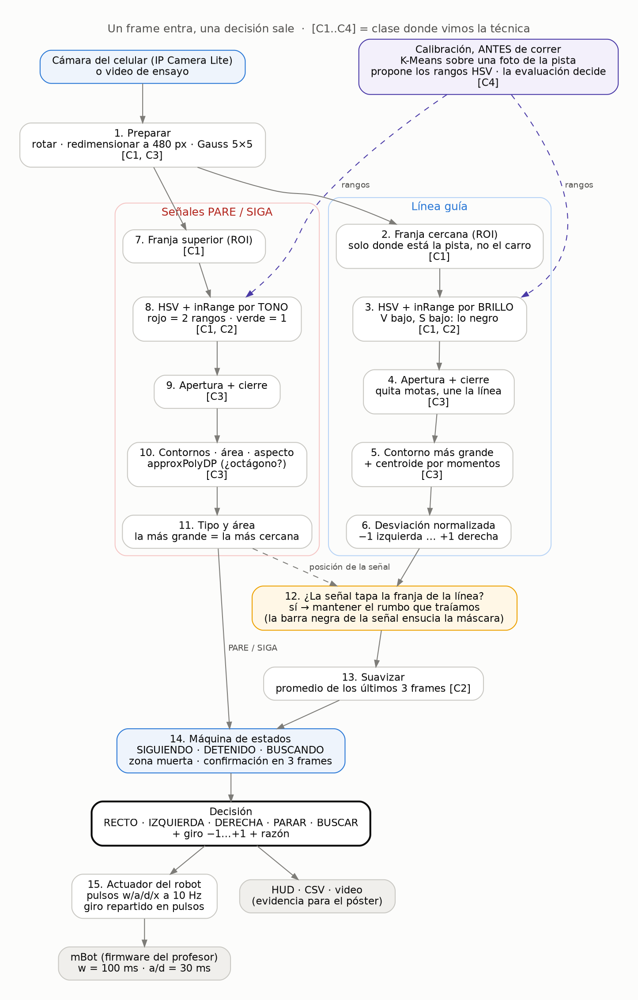
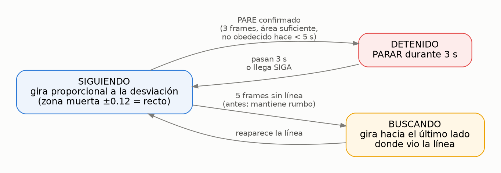

# El algoritmo, etapa por etapa, y por qué así

Este documento es la sustentación del diagrama. Para cada etapa: qué hace, por qué se hizo así y no de otra forma, qué medimos para decidirlo y de qué clase sale la técnica. Si el profesor pregunta "¿por qué?", la respuesta está aquí.

Los números de cada sección son los mismos del diagrama. El código fuente del diagrama está en `docs/diagramas/algoritmo.dot`; se regenera con `dot -Tpng -Gdpi=150 docs/diagramas/algoritmo.dot -o docs/media/diagrama_algoritmo.png`.

## La idea en una frase

**Un frame entra, una decisión sale.** La línea y las señales se detectan por separado, cada una en su franja de la imagen, y una máquina de estados junta las dos cosas para decidir. Todo lo que se ve en la cámara se reduce a un número (la desviación) y una etiqueta (PARE, SIGA o nada).

---

## 0. Calibración, antes de correr — K-Means [clase 4]

**Qué hace.** Se le pasa una foto de la pista y K-Means agrupa los colores. Los centroides son los colores dominantes (piso, línea, señales) y de sus percentiles salen los rangos HSV para `inRange`.

**Por qué así.** Los rangos de color dependen de la luz del salón. Calibrarlos a ojo es lento y subjetivo; con K-Means se rehace en dos minutos el día de la carrera.

**Por qué no dentro del loop.** K-Means es caro para correrlo en cada frame. `inRange` es una comparación directa y sí aguanta tiempo real. Por eso K-Means propone offline e `inRange` ejecuta en vivo.

**Evidencia.** Coincide con lo medido a mano: rojo H 167-179 contra 173-175 medido; verde 62-78 contra 69-74. Y un límite importante: para la línea propuso V ≤ 129, que sube la detección de 91.1% a 93.3% pero agarra sombras (los saltos pasan de 16 a 24). **K-Means propone, la evaluación decide.**

## 1. Preparar — rotar, redimensionar, suavizar [clases 1 y 3]

**Qué hace.** Gira la imagen si el celular quedó de lado, la lleva a 480 px de ancho y le pasa un Gauss de 5×5.

**Por qué así.**
- **Rotar:** todo lo que sigue (franjas, izquierda y derecha) asume que la pista se ve de frente.
- **Redimensionar:** los FPS deciden si la corrección llega a tiempo. Procesar 480 px en vez de 1080 es unas cuatro veces menos píxeles.
- **Gauss:** el ruido de la cámara crea motas que después parecen línea o señal. Suavizar antes de segmentar las borra.

## 2 a 6. La línea guía

### 2. Franja cercana (ROI) [clase 1]

**Qué hace.** Solo se mira una franja horizontal de la imagen.

**Por qué así.** Dos razones. La primera: en el montaje sobre el robot, el propio carro ocupa la parte de abajo de la imagen (en los videos del profesor, el 40% inferior), y el chasis cian y las pilas naranjas confundirían todo. La segunda: la franja cercana es lo que el robot tiene que corregir *ya*; lo que está más adelante es futuro.

**Ojo.** La franja depende del montaje. Por eso se ajusta sin tocar código: `--roi-linea 0.78 1.00` o un perfil como `config_celular.json`.

### 3. HSV + `inRange` por brillo [clases 1 y 2]

**Qué hace.** Convierte a HSV y se queda con los píxeles de brillo bajo (V ≤ 110) y saturación baja (S ≤ 90). El tono se deja completo (0-179).

**Por qué por brillo y no por tono.** La línea es negra. Un color oscuro no tiene tono estable: con S baja, H es ruido. Lo que separa la línea del piso es el brillo. Medido: línea entre V = 29 y 90, piso alrededor de V = 200.

**Por qué HSV y no RGB.** En RGB una sombra cambia los tres canales a la vez. En HSV casi todo el cambio va a V, así que el rango aguanta mejor la luz.

**Por qué 110 y no otro número.** Barrimos 90, 100, 110, 120 y 129 (`tools/barrido.py vmax ...`). 110 es el que da menos saltos sin perder ninguna recuperación.

### 4. Apertura y después cierre [clase 3]

**Qué hace.** La apertura (erosión → dilatación) borra motas sueltas. El cierre (dilatación → erosión) tapa huecos y une la línea si quedó partida.

**Por qué en ese orden.** Primero se limpia y después se rellena. Al revés, el cierre agrandaría el ruido antes de quitarlo.

**Por qué no pasa lo de la clase 3.** Allá la erosión borraba los bordes de Canny, que miden un píxel. Aquí la máscara es la línea *rellena*, que es ancha, y sobrevive a la erosión.

### 5. Contorno más grande + centroide por momentos [clase 3]

**Qué hace.** `findContours`, se queda con el de mayor área si pasa el mínimo, y saca el centroide con `cx = m10 / m00`.

**Por qué el más grande.** En la franja, la línea es el objeto oscuro grande. Lo demás son sombras y ruido. El área mínima evita que, sin línea, cualquier manchita pase por línea.

**Por qué momentos y no el centro de la caja.** El centroide pondera toda la forma. En una curva, la caja se estira y su centro se va para un lado; el centroide sigue donde está la masa de la línea.

### 6. Desviación normalizada

**Qué hace.** `desviacion = (cx − mitad) / mitad`, un número entre −1 (línea a la izquierda) y +1 (a la derecha).

**Por qué normalizada.** Para que el control no dependa de la resolución. Con la webcam o con el celular, "media imagen a la derecha" vale siempre +0.5.

## 7 a 11. Las señales

### 7. Franja superior (ROI) [clase 1]

**Por qué.** Deja fuera el carro, que trae naranja (pilas, H 6-15) y cian (chasis), y que se colarían como señal.

### 8. HSV + `inRange` por tono [clases 1 y 2]

**Qué hace.** Una máscara roja y una verde. La roja une dos rangos con un OR.

**Por qué dos rangos para el rojo.** H es un círculo y el rojo queda partido entre 0 y 179. En los videos del profesor la señal roja cayó en H = 173-175: con solo el rango bajo no la veríamos.

**Por qué aquí sí por tono.** A diferencia de la línea, las señales son colores saturados. Lo que las identifica es el tono.

### 9. Apertura + cierre [clase 3]

Igual que en la línea: limpiar motas y tapar huecos, con las mismas iteraciones de la configuración.

### 10. Contornos, área, aspecto y `approxPolyDP` [clase 3]

**Qué hace.** Para cada contorno: área mínima, relación de aspecto de la caja (ni tira larga ni delgada) y aproximación poligonal para contar vértices.

**Por qué la forma no es obligatoria.** Lo medimos: en los videos del profesor las señales son cartulinas inclinadas. `approxPolyDP` da 4 o 5 vértices y la circularidad queda entre 0.58 y 0.72, cuando un octágono de frente da 0.95. Exigir octágono nos dejaría sin detectar ninguna. Entonces **el color y el área deciden y la forma suma confianza** (`es_octagono`). Con `exigir_octagono = true` se vuelve estricto.

### 11. Tipo y área

**Qué hace.** Entre todas las candidatas se queda con la de mayor área.

**Por qué la mayor.** La más grande es la más cercana, y es la que hay que obedecer. El área funciona como medida de distancia: solo se frena cuando la señal está lo bastante cerca.

## 12. ¿La señal tapa la franja de la línea? — mantener el rumbo

**El problema.** Las señales van montadas sobre una barra negra que cruza la pista. Cuando la señal llega a la franja de la línea, esa barra entra en la máscara (es negra, igual que la línea) y tira el centroide hacia un lado. Justo al pasar una señal SIGA, el robot daría un volantazo.

**Cómo lo vimos.** Graficando la desviación en el tiempo (`docs/media/timeline_clips.png`): todos los picos bruscos caían dentro de las ventanas con señal. Medido en los 4 clips de ruta ideal:

| | Cambio de desviación entre frames con señal a la vista | |
|---|---|---|
| | p95 | máximo |
| Sin esta etapa | 0.135 | 0.51 |
| Con esta etapa | **0.017** | **0.06** |

Sin señal a la vista, el p95 ya era 0.035: la señal multiplicaba la inestabilidad por cuatro.

**La solución.** Si la caja de la señal (`boundingRect`, clase 3) se cruza con la franja de la línea, se mantiene la última desviación limpia que traíamos. El HUD lo avisa: "rumbo congelado: señal sobre la línea".

**Resultado global.** Los saltos sospechosos bajaron de 4 a **0**, el zigzag en ruta ideal quedó en 0, y las 5 recuperaciones siguen bien.

**El costo, dicho por nosotros.** Mientras la señal tapa la franja, el robot no sigue la curva: mantiene el rumbo. Si una señal estuviera justo en una curva cerrada, eso sería un problema. En los videos del profesor la señal pasa en 1 a 3 segundos, y en ese tiempo el rumbo que traía sirve.

**Por qué no borrar la barra de la máscara.** Lo intentamos contando cuántos píxeles de cada fila son oscuros: una fila casi toda negra sería la barra. No separa bien. La barra no siempre cruza todo el ancho (la señal la tapa), y una curva cerrada también llena filas enteras. Quitar filas habría hecho perder la línea justo en las curvas.

## 13. Suavizar — promedio de los últimos 3 frames [clase 2]

**Qué hace.** Promedia la desviación de los últimos 3 frames.

**Por qué.** Quita el temblor de frame a frame sin retrasar mucho.

**Por qué 3 y no 5.** Barrido: con 1 frame hay 12 saltos, con 3 quedan 4, con 5 quedan 0. Pero 5 frames son 167 ms de retraso a 30 fps, y ese retraso no se puede medir sobre video grabado: en la pista, el carro llegaría tarde a las curvas. Nos quedamos con 3, y si zigzaguea en la pista, se sube.

## 14. Máquina de estados

**Por qué estados y no un "si ve rojo, pare".** Porque el robot tiene memoria de lo que viene haciendo:

- **SIGUIENDO:** gira proporcional a la desviación. Con la desviación dentro de ±0.12 (zona muerta) sigue recto, para no oscilar por dos píxeles.
- **DETENIDO:** obedece un PARE confirmado durante 3 segundos (confirmar con el profesor). Un SIGA puede cortar la espera.
- **BUSCANDO:** si pierde la línea 5 frames seguidos, gira hacia el último lado donde la vio. Antes de eso mantiene el rumbo, porque perderla un instante suele ser un reflejo.

**Las protecciones contra falsos PARE.** Tres filtros: la señal tiene que aparecer en 3 frames seguidos, con área suficiente (cerca) y sin haber obedecido otra hace menos de 5 segundos. Así un reflejo rojo no frena el robot y la misma señal no lo frena dos veces.

**Evidencia.** Los videos de descarrilamiento del profesor dicen en el nombre hacia dónde se fue la línea. En los 5, el robot busca hacia el lado correcto. Es una prueba automática: `tools/evaluar.py` la verifica cada vez.

**Por qué no un PID.** No lo hemos visto en el curso. Lo nuestro es proporcional con zona muerta. Si nos piden mejorarlo, un término derivativo ayudaría contra el zigzag.

## 15. Actuador — pulsos a 10 Hz

**El hallazgo.** En el firmware del profesor, los comandos son pulsos, no estados: `w` avanza 100 ms y el robot se detiene solo; `a` y `d` giran 30 ms. Además el Arduino se bloquea con un `delay()` en cada comando.

**Por qué 10 Hz y no un comando por frame.** Si mandamos 30 comandos por segundo, se llena el buffer del puerto serie y el robot ejecuta órdenes viejas: iría a ciegas. A 10 Hz, cada `w` alcanza a ejecutarse antes del siguiente.

**Por qué el giro en pulsos.** Un pulso de giro son 30 ms, un empujoncito. Se acumula la magnitud del giro y se manda un pulso cada vez que el acumulado pasa de 1; el resto del tiempo se manda `w`. Con giro 0.3 salen unos 3 pulsos de giro y 7 de avance de cada 10. Es control proporcional con lo único que el firmware permite, porque la velocidad está fija.

Detalle completo en `docs/robot.md`.

---

## Cómo se ve funcionando

- **Línea de tiempo de los 9 clips:** `docs/media/timeline_clips.png`. La línea azul es la desviación; las franjas marcan cuándo vio PARE, SIGA o estaba buscando la línea.
- **Los 27 frames de calibración procesados:** `docs/media/frames_procesados.jpg`.
- **Video con el HUD:** `docs/media/demo_sustentacion.mp4`.

## Limitaciones que sabemos (mejor decirlas nosotros)

1. **Todo está calibrado con los videos del profesor.** El montaje de mañana es otro; hay que recalibrar la franja y verificar los rangos con K-Means.
2. **Un cruce de líneas no lo resolvemos:** tomaríamos el contorno más grande, que puede ser el ramal equivocado.
3. **Mientras una señal tapa la franja, el robot no sigue curvas** (etapa 12).
4. **Al recuperar la línea puede agarrar otro tramo.** En `noReconoceIzquierda3`, después de buscar hacia la izquierda, reaparece un tramo de la línea al otro lado (desviación +0.95) y el robot lo sigue. En una pista con curvas muy cerradas eso podría llevarlo por el camino equivocado.
5. **Nada de esto se ha probado con el robot todavía.** Todo está medido sobre video.
