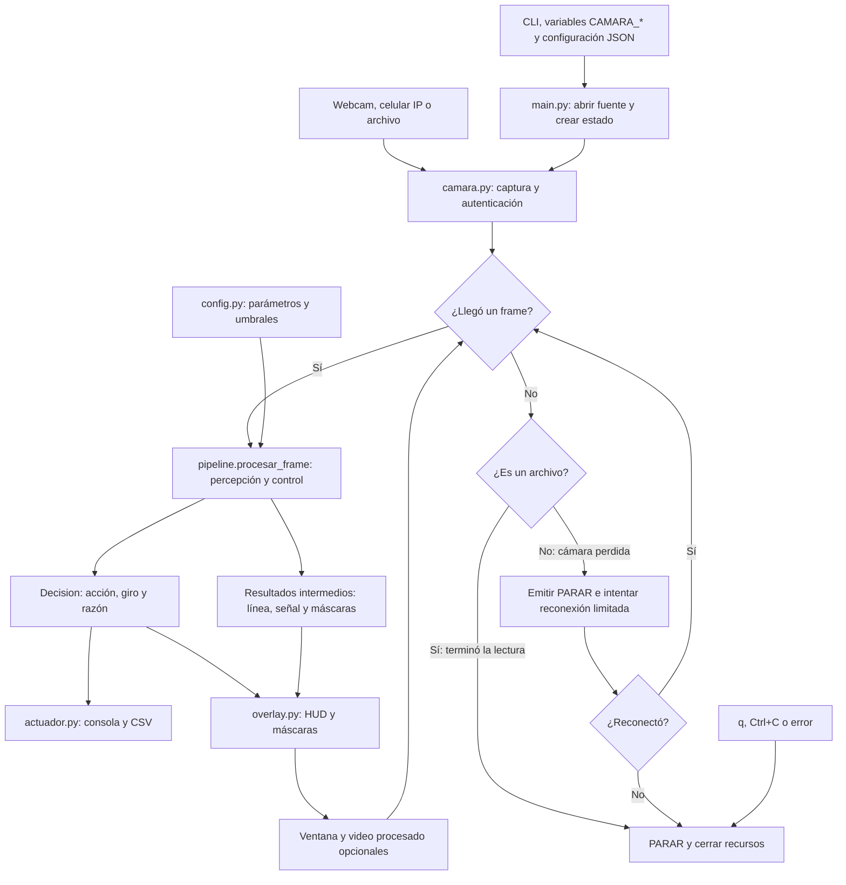
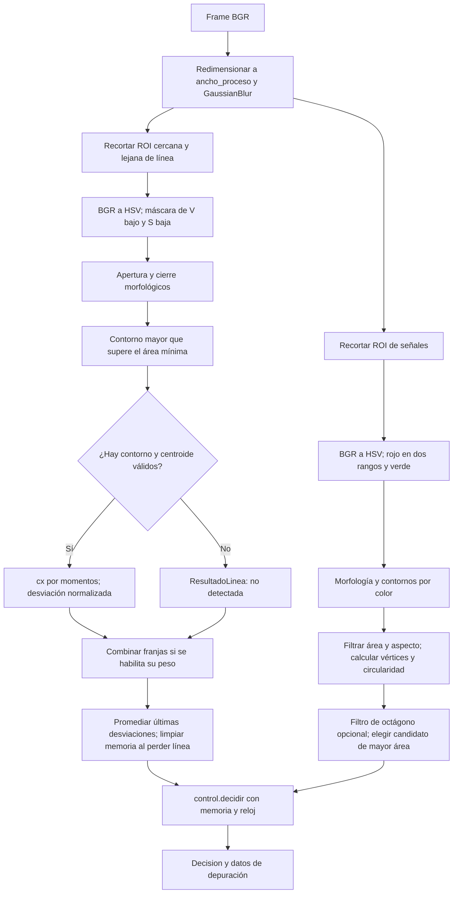
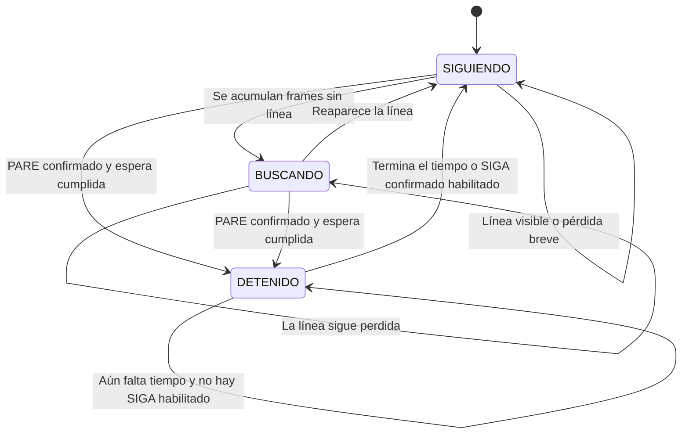

# Arquitectura y flujo del reto 1

Estado de la integración: 2026-09-28. Un frame BGR entra y una `Decision` sale. La percepción está separada del control; los actuadores disponibles escriben en consola y CSV. La conexión física al robot todavía no está implementada.

## 1. Sistema completo



El `PARAR` de cierre o pérdida de captura se entrega a los actuadores configurados. Hoy produce salida de consola/registro; no implica haber enviado una orden a un robot. Un archivo no se reabre al terminar. Para archivos, el reloj del control es `número_de_frame / fps_del_video`; para cámaras es el reloj monotónico. Procesar un video rápido no acorta el PARE dentro del tiempo del video.

## 2. Algoritmo por frame



Las dos ramas de percepción se dibujan separadas para explicar sus responsabilidades; Python las ejecuta secuencialmente. No se usa K-Means dentro del ciclo de video.

### Línea

La línea es cinta oscura sobre piso claro. `inRange` conserva brillo V bajo y saturación S baja; H queda abierto porque el tono de un gris no es estable. La apertura elimina componentes pequeños y el cierre rellena huecos. Se elige el contorno de mayor área por encima del mínimo y se calcula `cx = m10 / m00`.

La desviación es `(cx - ancho / 2) / (ancho / 2)`: negativa a la izquierda, positiva a la derecha. El control usa el promedio de las últimas tres detecciones por defecto. Si se pierde la línea, se vacía ese historial.

| Parámetro actual | Valor | Motivo |
|---|---|---|
| `ancho_proceso` | 480 px | Base común de procesamiento y áreas |
| `roi_linea_cercana` | 0.40–0.58 del alto | Mira justo por encima del carro en los clips |
| `roi_linea_lejana` | 0.18–0.40 del alto | Indicador de dirección de la curva |
| `hsv_linea` | (0,0,0)–(179,90,110) | Línea oscura y poco saturada |
| `peso_linea_lejana` | 0.0 | La mezcla empeoró las métricas de estos clips |
| `suavizado_desviacion` | 3 frames | Reduce saltos, introduce demora temporal |

La franja lejana se sigue calculando para el HUD. El indicador llamado `curvatura` es una diferencia de desviaciones, no un radio geométrico ni un control anticipativo activo. Cambiar el montaje o la resolución de proceso exige revisar ROI y áreas mínimas.

### Señales

La ROI ocupa el 0–55% del alto para excluir las pilas y el chasis del carro. El rojo necesita dos rangos de tono y sus máscaras se unen con OR. Para cada color se limpian máscaras, se filtran contornos por área y aspecto, y se calculan aproximación poligonal y circularidad `4πA/P²`.

El detector devuelve un único candidato, el de mayor área. `es_octagono` indica si supera los filtros geométricos. Con `exigir_octagono=False` esos filtros no excluyen una señal: las cartulinas de los clips dan 4–5 vértices y se decidió preservar su detección. Con `True` solo se aceptan candidatos que los superan.

Este filtro de forma es aproximado: contar 7–9 vértices y exigir circularidad mínima no garantiza separar un círculo de un octágono. La ausencia de falsas detecciones en los cinco clips negativos no demuestra inmunidad frente a cualquier objeto rojo o verde. El área es un indicador de tamaño aparente, no una distancia medida.

## 3. Máquina de estados



El orden de las reglas importa:

1. Confirmar la misma señal en `frames_confirmacion_senal` detecciones consecutivas; si desaparece o cambia, reiniciar la cuenta.
2. Si está `DETENIDO`, mantener `PARAR` hasta cumplir el tiempo o ver un SIGA confirmado cuando `siga_reanuda` está activado.
3. Si hay PARE confirmado y terminó `espera_entre_senales`, entrar a `DETENIDO`.
4. Sin línea, conservar brevemente el rumbo anterior y luego `BUSCAR` hacia el último lado conocido. Si nunca hubo un lado conocido, la regla actual elige derecha.
5. Con línea, volver a `SIGUIENDO`: dentro de la zona muerta, `RECTO`; fuera, giro proporcional limitado a [-1,1].

Al salir de `DETENIDO`, las reglas de línea se evalúan en el mismo frame: el estado puede volver inmediatamente a `BUSCANDO`. La espera entre señales limita la frecuencia de PARE; no identifica una señal física. Si la misma señal permanece visible más allá de esa espera, puede volver a detener el robot.

**Parámetros pendientes de acordar con el docente:** PARE dura 3 segundos y SIGA puede interrumpirlo (`siga_reanuda=True`). Son valores de desarrollo, no una interpretación confirmada del reglamento.

## 4. Contratos y responsabilidades

| Módulo | Responsabilidad | Responsable |
|---|---|---|
| `main.py`, `camara.py` | Entrada, autenticación, reloj, reconexión, presentación y cierre | Santiago |
| `pipeline.py` | Orden y coordinación de etapas | Daniel |
| `linea.py` | Máscara y posición de la línea | Juan David |
| `senales.py` | Máscaras y candidatos PARE/SIGA | Daniel |
| `control.py` | Máquina de estados sin OpenCV | Juan David |
| `actuador.py` | Consumir decisiones: consola, CSV y futuros adaptadores | Compartido |
| `overlay.py` | Presentación de resultados y máscaras | Compartido |
| `config.py`, `tipos.py` | Parámetros y contratos comunes | Los tres |

Los contratos están en `reto/tipos.py`; esta integración los conserva:

```python
linea.detectar(roi, config) -> ResultadoLinea
senales.detectar(roi, config) -> ResultadoSenal
control.decidir(estado, linea, senal, config, ahora=None) -> Decision
pipeline.procesar_frame(frame, estado, config, ahora=None) -> (Decision, dict)
actuador.aplicar(decision, contexto=None)
actuador.cerrar()
```

`ResultadoLinea` incluye detección, centro x, desviación, área y máscara. `ResultadoSenal` incluye tipo, área, centro, vértices, contorno, máscara y `es_octagono`. Las coordenadas geométricas son locales a cada ROI; el overlay las traslada al dibujar. `Decision` contiene acción, giro y razón; `Estado` conserva memoria entre frames.

## 5. Técnicas y evidencia

| Etapa | Técnicas del curso |
|---|---|
| Preparación | Resize y ROI (clase 1), Gauss (clase 3) |
| Color | HSV (clase 1), inRange y operaciones lógicas (clase 2) |
| Limpieza y geometría | Morfología, contornos, momentos, aproximación poligonal y aspecto (clase 3) |
| Promedio y decisión | Operaciones aritméticas, comparaciones y memoria de estados |
| Calibración fuera de línea | K-Means básico (clase 4) |

La referencia es [técnicas permitidas](reto/tecnicas-permitidas.md). El detalle de mediciones está en la [bitácora](bitacora.md). Un porcentaje alto de detección solo mide cuántas veces el algoritmo devuelve línea; debe acompañarse de máscaras, saltos y resultados por clip para detectar sombras u otros objetos.

## 6. Simulador, robot y trabajo del equipo

`simulacion/index.html` implementa una demo autónoma en JavaScript. No existe todavía un puente entre esa página y `procesar_frame`/`Decision`. La [decisión 0003](decisiones/0003-simulador-y-actuador.md) describe cómo integrarlo mediante un actuador; sigue siendo una propuesta.

Para cerrar el lazo, la imagen que dibuje el simulador debe entrar al pipeline y la decisión debe cambiar su siguiente imagen. Para el robot hará falta un adaptador que traduzca `Decision` a la API autorizada por el profesor. Ninguna de esas conexiones forma parte de esta estabilización; no se toca Arduino ni electrónica.

Antes de modificar archivos de otro integrante, avisar. Para cambios compartidos, mantener `tipos.py` y `config.py` como referencia. Usar ramas de trabajo, revisar el diff antes de integrar, ejecutar las [pruebas](flujo-de-pruebas.md) y registrar decisiones y ensayos. La [decisión 0004](decisiones/0004-estabilizacion-integracion.md) documenta la resolución del rebase y el criterio de compatibilidad.
