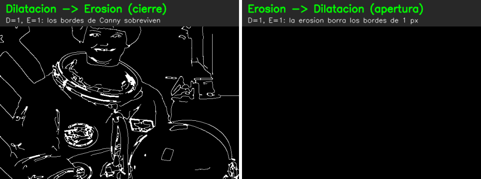
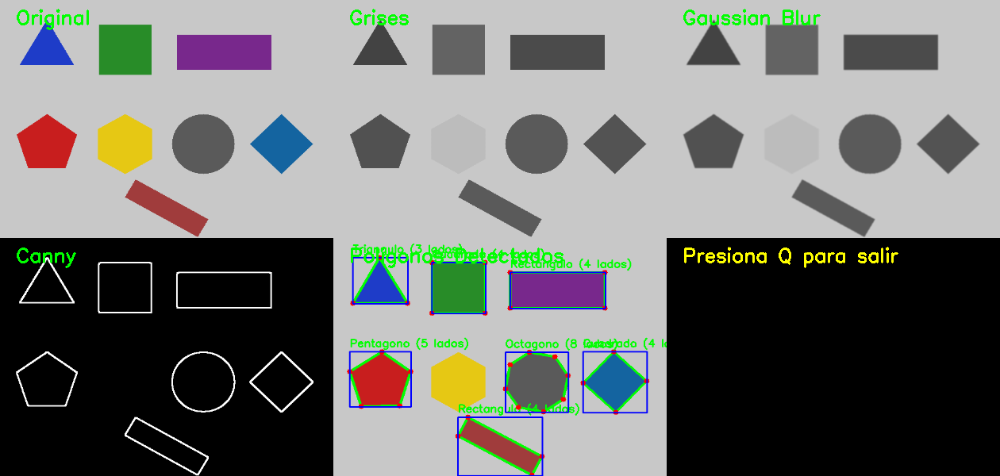

# Clase 3 — Filtros y detección de figuras

> Scripts: `uv run python clase3/filtros.py` · `uv run python clase3/contornos.py`
> Slides: `los slides del profesor (fuera del repo, en contenidoClase/)` (págs. 9–25)
> Apuntes completos de lo anterior: [clase 1](clase1.md) · [clase 2](clase2.md)

---

## 0. Repaso rápido de las clases 1 y 2

**Clase 1 — composición de una imagen (slides 2–6)**

- Una imagen es una matriz NumPy de forma `(alto, ancho, canales)` con valores `uint8` (0–255). La cámara entrega `frame.shape == (480, 640, 3)`.
- OpenCV guarda los canales en orden **BGR**, no RGB. Amarillo = `[0, 255, 255]`.
- En gris queda un solo canal: `(480, 640)`. OpenCV calcula cada píxel como `0.299·R + 0.587·G + 0.114·B`.
- HSV y CIELab son otros espacios de color. Se usan para segmentar por color (vienen más adelante).

**Clase 2 — máscaras (slides 7–8)**

- Una máscara es una imagen binaria: 255 = conservar, 0 = descartar. Con un AND píxel a píxel se recorta una región.
- `absdiff` + `threshold` produce una máscara con lo que cambió entre dos imágenes (la base de la detección de movimiento).
- **La salida de Canny es una máscara**: bordes en 255 y fondo en 0. Por eso luego se le aplica morfología.
- Ojo con el nombre: en filtros también se le dice "máscara" al **kernel** (máscara de convolución). Son dos ideas distintas con el mismo nombre.

---

## 1. Qué hace el script

```
frame (BGR) → gris → GaussianBlur → Canny → dilatar/erosionar → mosaico 2×2 + panel
```

| Paso | Función | Qué hace | Por qué |
|---|---|---|---|
| 1 | `cv2.cvtColor(frame, COLOR_BGR2GRAY)` | 3 canales → 1 | Canny trabaja sobre intensidad |
| 2 | `cv2.GaussianBlur(gris, (k,k), 0)` | Promedio ponderado con los vecinos | Quita ruido que Canny tomaría como bordes |
| 3 | `cv2.Canny(gauss, bajo, alto)` | Gradiente + histéresis | Máscara de bordes de 1 px |
| 4 | `cv2.dilate` / `cv2.erode` | Engordar / adelgazar lo blanco | Unir bordes rotos o quitar ruido |
| 5 | `GRAY2BGR` + `hstack`/`vstack` | Arma la cuadrícula 2×2 (1280×960) | Para unirlas, todas deben tener 3 canales y el mismo tamaño |

---

## 2. Un filtro es una convolución con un kernel

Un kernel pequeño (3×3, 5×5…) se desliza sobre la imagen. Cada píxel nuevo es la suma de sus vecinos, cada uno multiplicado por su peso en el kernel (slide 10).

**Filtro gaussiano 3×3:**

```
        | 1 2 1 |
1/16 ·  | 2 4 2 |      el centro pesa más; las esquinas, menos
        | 1 2 1 |
```

Ejemplo del slide 13: un píxel de 200 rodeado de 10 queda en **57.5**. El valor extremo se "diluye" entre sus vecinos.

En el código:

- `GaussianBlur(gris, (k, k), 0)`: el `0` es σ. Con σ = 0, OpenCV lo calcula a partir del tamaño: `σ = 0.3·((k−1)/2 − 1) + 0.8`.
- **k tiene que ser impar**, porque el kernel necesita un píxel central. Por eso el script le suma 1 si es par y fuerza mínimo 1. Con `k = 1` no hay suavizado.
- Con k más grande la imagen queda más borrosa: hay menos bordes falsos, pero también se pierden los detalles finos. En la imagen de prueba, Canny(100, 200) marcó **20 667** píxeles de borde sin blur, **14 271** con k = 5 y **4 131** con k = 15.

> **Relación con lo que ya sabes (HPC):** cada píxel se calcula de forma independiente con sus vecinos. Es un *stencil*, el mismo patrón de un kernel de CUDA, y por eso los filtros corren tan bien en GPU (`cv2.cuda`). Una CNN (ResNet, YOLO) es este mismo filtro, pero los pesos del kernel se **aprenden** en lugar de fijarse a mano.

---

## 3. Canny (slides 15–17)

1. **Suavizado.** `cv2.Canny` no suaviza por dentro, por eso el Gauss va antes.
2. **Sobel.** Calcula `Gx` (cambios horizontales) y `Gy` (cambios verticales). Con eso saca la magnitud `G` y la dirección `θ = arctan(Gy/Gx)`. Por defecto OpenCV usa `|Gx| + |Gy|` como magnitud (`L2gradient=False`).
3. **Supresión de no máximos.** Solo conserva el píxel más fuerte en la dirección del gradiente, y así los bordes quedan de 1 px de grosor.
4. **Umbral por histéresis:**
   - `G > alto` → borde fuerte (se queda).
   - `G < bajo` → se descarta.
   - Entre los dos → se queda **solo si está conectado** a un borde fuerte. Así se completan los bordes sin agregar ruido suelto.

Detalles del script:

- El `min`/`max` garantiza que bajo ≤ alto. OpenCV igual los intercambia si vienen al revés (lo verifiqué), así que en la práctica sirve para que el texto en pantalla salga bien.
- ⚠️ **El trackbar llega solo hasta 255, pero el gradiente puede ser mucho mayor.** En el slide 16, `G = 760`; en la imagen de prueba el máximo fue 1164 y el 6.7 % de los píxeles tenía G > 255. Con este límite no se puede ser tan estricto como el ejemplo del slide (umbral de 300). Para experimentar, sube el máximo del trackbar a ~500.
- Regla práctica de Canny: una proporción bajo:alto de 1:2 o 1:3. Los valores por defecto (100, 200) la cumplen.

---

## 4. Operaciones morfológicas (slides 18–20)

Se aplican sobre imágenes binarias (máscaras). El kernel `np.ones((3,3))` es el **elemento estructurante**.

| Operación | Regla | Efecto sobre lo blanco |
|---|---|---|
| **Dilatación** | El píxel queda en 1 si **algún** vecino es 1 (máximo) | Crece; rellena huecos y une bordes cortados |
| **Erosión** | El píxel queda en 1 solo si **todos** los vecinos son 1 (mínimo) | Se encoge; borra puntos sueltos |

- `iterations = n` repite la operación n veces. Con `iterations = 0` no hace nada (devuelve la entrada; verificado).
- **Dilatar → erosionar** con el mismo n es un **cierre** (closing). Cierra huecos y une bordes, y conserva el grosor. Da exactamente lo mismo que `cv2.morphologyEx(img, cv2.MORPH_CLOSE, kernel, iterations=n)` (verificado).
- **Erosionar → dilatar** es una **apertura** (opening). Elimina ruido pequeño (el slide 18 lo muestra con puntos blancos).

### ⚠️ La trampa de este script

Aquí la morfología se aplica sobre la salida de Canny, que tiene **bordes de 1 px**. Una erosión 3×3 exige que todo el vecindario sea blanco, y eso nunca pasa en una línea de 1 px, así que **borra todos los bordes**. Por eso el modo *Erosión → Dilatación* sale casi o totalmente negro.



Con los valores por defecto (D=1, E=1), *D→E* dejó ~17 000 píxeles blancos y *E→D* dejó **0**.

**Conclusión:** la apertura tiene sentido sobre máscaras "rellenas", como las de segmentación por color con `inRange`, no sobre bordes finos. Para bordes lo que funciona es el cierre.

---

## 5. Detalles de OpenCV / interfaz

- `createTrackbar` exige una función callback, y por eso existe `nada`. Los valores se leen en cada frame con `getTrackbarPos` (polling).
- `setMouseCallback`: un clic izquierdo dentro del cuadro (20–40, 20–40) activa el modo 0 y dentro de (20–40, 60–80) activa el modo 1. Por eso `modo_morfologico` es `global`.
- `cv2.waitKey(1)` espera 1 ms, y además es lo que deja que la ventana se redibuje. Sin él, `imshow` no muestra nada.
- `& 0xFF` toma solo el byte bajo de la tecla; `27` es Esc.
- `try/finally` libera la cámara aunque ocurra un error.
- `cap.set(640, 480)` es una **petición** y la cámara puede ignorarla. El mosaico se adapta porque todo sale del mismo frame, pero el panel y los títulos están en píxeles fijos.

---

## 6. Experimentos para hacer en clase

1. **Gauss 1 vs 15** con los umbrales fijos: fíjate cuánto "ruido de bordes" desaparece.
2. **Umbral bajo = alto**: la histéresis deja de actuar y los bordes quedan más cortados.
3. **D→E con D=2, E=2** vs **D=2, E=0**: el cierre conserva el grosor; solo dilatar lo engorda.
4. **E→D con E=0**: equivale a solo dilatar, porque la erosión con 0 iteraciones no hace nada.
5. Sube el máximo de los trackbars de Canny a 500 y compara.

---

## 7. Detección de figuras geométricas (`contornos.py`, slides 21–25)

```
frame → gris → Gauss → Canny → dilatar ×1 → findContours → approxPolyDP → contar vértices → boundingRect → dibujar
```

Hasta Canny es lo mismo que `filtros.py`. Lo nuevo empieza en los contornos.

### 7.1 Encontrar contornos

```python
contornos, _ = cv2.findContours(bordes, cv2.RETR_EXTERNAL, cv2.CHAIN_APPROX_SIMPLE)
```

- Recorre la máscara de bordes y devuelve cada figura como una **lista de puntos (x, y)** de su borde. Cada contorno tiene forma `(N, 1, 2)`.
- `RETR_EXTERNAL` entrega solo los contornos **exteriores** e ignora los huecos internos. Otras opciones: `RETR_LIST` (todos los contornos, sin jerarquía) y `RETR_TREE` (todos, con la jerarquía completa).
- `CHAIN_APPROX_SIMPLE` guarda solo los extremos de los tramos rectos: un rectángulo queda con 4 puntos en vez de cientos. `CHAIN_APPROX_NONE` los guarda todos.
- La función devuelve `(contornos, jerarquía)`. Por eso se escribe `contornos, _ =`.
- **¿Por qué se dilata antes?** Canny deja bordes de 1 px con cortes, y un borde abierto da un contorno con área ≈ 0 que luego se descarta. Una dilatación cierra esos huecos; es la primera mitad del *cierre* de la sección 4.

### 7.2 Filtrar por área

`cv2.contourArea(contorno) < area_minima` descarta el ruido y los bordes sueltos. El área se mide en píxeles del **frame original**, no del mosaico.

### 7.3 `cv2.approxPolyDP(contorno, epsilon, True)`: menos vértices, misma forma

Usa el algoritmo de **Douglas–Peucker** (slide 24):

1. Une el primer y el último punto con una recta.
2. Busca el punto más alejado de esa recta (distancia `d`).
3. Si `d > epsilon`, ese punto es una esquina real: divide el contorno ahí y repite el proceso en cada mitad.
4. Si `d ≤ epsilon`, elimina todos los puntos intermedios.

- **`epsilon`** es la tolerancia en píxeles. El script la calcula como `(precision / 100) * perímetro`: al ser relativa al tamaño, la misma "precisión" sirve para figuras grandes y pequeñas.
- **`cv2.arcLength(contorno, True)`** da el perímetro. El `True` indica que el contorno es cerrado.
- **Regla:** mayor epsilon → menos vértices. `len(aproximacion)` es el número de lados, y con eso `obtener_nombre_poligono` le pone nombre.

Resultado de mi prueba con figuras sintéticas:

| Precisión | Triángulo | Círculo |
|---|---|---|
| 1 % | 4 vértices → "Rectángulo" ❌ | 16 vértices |
| 2 % (por defecto) | 3 ✅ | 8 → "Octágono" |
| 4 % | 3 ✅ | 8 → "Octágono" |

### 7.4 `cv2.boundingRect(aproximacion)` → `(x, y, w, h)` y recorte

Devuelve el rectángulo **alineado a los ejes** más pequeño que contiene la figura (slide 25): `x = minX`, `y = minY`, `w = maxX − minX`, `h = maxY − minY`.

En el script se usa para tres cosas:

- dibujar la caja azul,
- poner el texto en `(x, y − 10)`,
- distinguir cuadrado de rectángulo: si `w / h` está entre 0.90 y 1.10, es cuadrado.

**Recortar la figura detectada** es el ROI de la clase 1:

```python
x, y, w, h = cv2.boundingRect(aproximacion)
recorte = frame[y:y + h, x:x + w].copy()     # [filas, columnas]; .copy() para no tocar el frame
```

### 7.5 Dibujo

- `cv2.drawContours(salida, [aproximacion], 0, (0, 255, 0), 3)` recibe una **lista** de contornos. El `0` indica que dibuja el primero de esa lista; `-1` los dibujaría todos.
- Los vértices se marcan con círculos rojos. Se usa `punto[0]` porque cada punto viene como `[[x, y]]`.

### 7.6 Lo que encontré al probarlo



1. **El hexágono amarillo no se detectó.** En gris, ese amarillo vale 188 y el fondo 200, así que casi no hay gradiente y Canny no ve el borde (el gris pesa mucho el verde y el rojo, y el amarillo es justo verde + rojo, así que queda casi tan claro como el fondo; ver clase 1). Con la cámara, usa un fondo que contraste, o segmenta por color en HSV (`inRange`, clase 2) y busca los contornos sobre esa máscara.
2. **Los círculos salen como "Octágono"**, o con 16 lados si la precisión es baja. Contar vértices no distingue un círculo. Lo usual es la **circularidad** `4π·área / perímetro²`: da ≈ 1 en un círculo, 0.785 en un cuadrado y 0.60 en un triángulo equilátero.
3. **Un rectángulo girado 45° sale como "Cuadrado".** Su caja alineada a los ejes es cuadrada (w/h = 1.0) aunque la figura mida 180×45. Para figuras giradas usa `cv2.minAreaRect(contorno)`, que devuelve el rectángulo rotado (en la prueba dio 184×49). Un cuadrado girado (rombo) sí sale bien.
4. **Con precisión de 1 % aparecen vértices de más** (el triángulo salió con 4). Para figuras limpias funciona bien entre 2 y 4 %.
5. **La cámara.** El original usaba `VideoCapture(1)`, la cámara externa del salón. En el Mac ese índice abría pero no daba imágenes. Ahora `abrir_camara()` prueba varios índices y confirma que llegue un frame. Uso: `uv run python clase3/contornos.py [indice]`.
6. **El mosaico se ve deformado.** Redimensiona cada vista a 420×300 (proporción 1.4), así que la cámara se ve un poco estirada. No afecta la detección, porque los cálculos se hacen sobre el frame original.

### Experimentos

- Sube "Precision Poligono" poco a poco frente a una figura dibujada a mano y mira cómo bajan los vértices.
- Pon "Area Minima" en 0: aparece ruido detectado como "polígonos".
- Muestra un objeto amarillo sobre papel blanco y luego sobre un fondo oscuro.

---

## Autoevaluación

<details><summary>1. ¿Qué pasa si epsilon es muy grande?</summary>Quedan muy pocos vértices: un pentágono puede terminar como triángulo.</details>
<details><summary>2. ¿Por qué se escribe <code>contornos, _ = cv2.findContours(...)</code>?</summary>Porque la función devuelve también la jerarquía de contornos, que aquí no se usa.</details>
<details><summary>3. ¿Cómo recortas la figura detectada?</summary><code>x, y, w, h = cv2.boundingRect(aprox)</code> y luego <code>frame[y:y+h, x:x+w]</code>.</details>
<details><summary>4. ¿Por qué el modo Erosión → Dilatación de <code>filtros.py</code> sale negro?</summary>Porque los bordes de Canny miden 1 px y la erosión 3×3 los borra todos antes de que la dilatación pueda actuar.</details>
